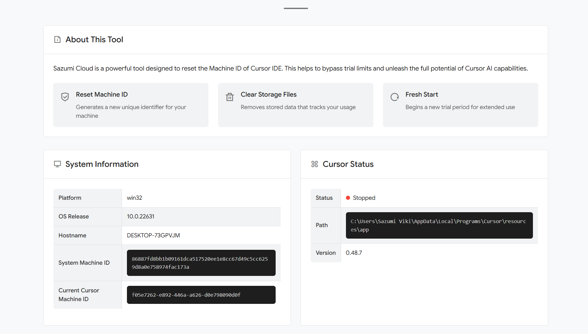
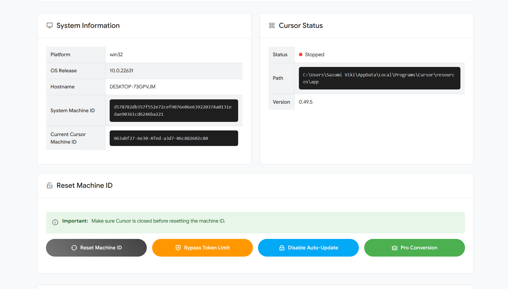
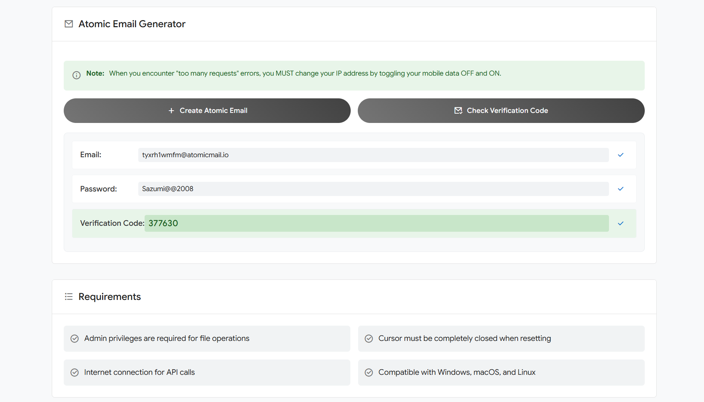

# 🛡️ Cursor Reset Tools
> *"Oh, you've banned my country from using Cursor Student? How cute. Let me introduce you to something better."*

## Preview Website 1



## Preview Website 2



## Preview Atomic Mail Generator



## Preview Pro Feature


Forget Cursor Student restrictions and country bans! This revolutionary web-based tool laughs in the face of Cursor IDE's arbitrary limitations, giving power back to developers from every corner of the globe. Who needs their "student program" when you can reset Machine IDs, bypass those frustrating token limits, and transform free trials into Pro features with a few clicks? We've built a system that not only circumvents machine ID restrictions but also prevents those pesky automatic updates designed to block our freedom. Because great AI tools should be accessible to everyone, not just those in Cursor's "approved" regions. Liberate your coding experience today!

## Advanced Bypass Features

- **Token Limit Bypass**: Remove restrictions on token usage for AI completions
- **Pro Trial Conversion**: Access Pro features without purchasing a subscription
- **Machine ID Reset**: Bypass the "Too many free trial accounts used on this machine" limitation
- **Auto Update Prevention**: Stop Cursor from updating and potentially removing bypass functionality
- **Atomic Email Generator**: Create disposable emails and capture verification codes automatically
- **Cross-Platform**: Compatible with Windows, macOS, and Linux
- **User-Friendly Interface**: Clean, modern UI with clear instructions
- **System Information**: Displays detailed system and Cursor installation info

## Atomic Email Generator

The integrated Atomic Email Generator provides a seamless way to create disposable email accounts for Cursor registrations:

- **One-Click Email Creation**: Generate new Atomic Mail accounts with a single click
- **Automatic Verification Codes**: Capture and display verification codes sent by Cursor
- **IP Management**: If you encounter "too many requests" errors, you can toggle your mobile data to change your IP address
- **Copy-to-Clipboard**: Easily copy email, password, and verification code with one click
- **Clean UI**: User-friendly interface that integrates perfectly with the Cursor Reset Tool

This feature eliminates the need for external disposable email services and streamlines the process of creating new Cursor accounts.

## Installation

1. **Clone the repository**

```bash
git clone https://github.com/sazumivicky/cursor-reset-tools.git
cd cursor-reset-tools
```

2. **Install dependencies**

```bash
npm install
```

3. **Start the application**

```bash
npm start
```

The server will start at http://localhost:3000

## Running with Administrator Rights

This tool requires administrator privileges to modify system files.

### Windows
```bash
# Start CMD as Administrator
cd path\to\cursor-reset-tools
npm start
```

### macOS/Linux
```bash
cd path/to/cursor-reset-tools
sudo npm start
```

## How it Works

Cursor identifies your machine using a unique ID stored in specific locations:

- **Windows**: `%APPDATA%\Cursor\machineId`
- **macOS**: `~/Library/Application Support/Cursor/machineId`
- **Linux**: `~/.config/cursor/machineid`

This tool:
1. Detects if Cursor is running (and warns you to close it)
2. Generates a new UUID to replace your existing machine ID
3. Clears cached files that store your usage data
4. Prevents automatic updates that could remove bypass functionality
5. Modifies system files to unlock Pro features and bypass token limits
6. Allows Cursor to treat your machine as a new device

## 💡 Recommended Tips

For best results when creating new Cursor accounts:

- **Use Integrated Atomic Mail Generator**: Generate disposable emails and capture verification codes directly within the app
- **Change IP When Needed**: If you encounter "too many requests" errors, toggle your mobile data to get a new IP address
- **Use Disposable Email Services**: Alternatively, you can use [Sazumi Cloud - Email Disposable](https://mail.sazumi.com) which works well with Cursor
- **Reset Machine ID First**: Always reset your machine ID before creating a new Cursor account
- **Use Private Browsing**: Register with private/incognito browser windows
- **Clear Cookies**: Clear browser cookies after registration for better security

## Technologies Used

- **Backend**: Node.js, Express
- **Frontend**: HTML, CSS, JavaScript
- **Template Engine**: EJS
- **Email API**: AtomicMail.io API integration
- **Utilities**: uuid, fs-extra, node-machine-id, node-fetch, user-agents

## ⚠️ Disclaimer

This tool is provided for educational and research purposes only. Use at your own risk. Sazumi Cloud developers are not responsible for any consequences arising from the use of this tool.

**Please consider supporting Cursor development by purchasing a legitimate license if you find their product valuable for your workflow.**

## License

This project is licensed under the MIT License - see the LICENSE file for details.

## 🤝 Contributing

Contributions are welcome! Please feel free to submit a Pull Request.

1. Fork the repository
2. Create your feature branch (`git checkout -b feature/cursor-fix`)
3. Commit your changes (`git commit -m 'Add cursor bypass fix'`)
4. Push to the branch (`git push origin feature/cursor-fix`)
5. Open a Pull Request

## 🔗 Links

- [GitHub Repository](https://github.com/sazumivicky/cursor-reset-tools)
- [Issue Tracker](https://github.com/sazumivicky/cursor-reset-tools/issues)
- [Donate to Sazumi Viki](https://sociabuzz.com/sazumi/tribe)

---

Made with ❤️ by Sazumi Cloud 